# Data pipeline for mini-GPT

**llm-data-pipeline** is a high-performance, concurrent ETL (Extract, Transform, Load) pipeline written in **Go**. It is designed to scrape, clean, and format data from various sources (Wikipedia, Reddit, StackOverflow) into a unified dataset suitable for training "mini-GPT"(https://github.com/b0tShaman/mini-GPT.git).

It includes a **Python** companion script for instant statistical analysis and token distribution visualization.

## 🛠️ Pipeline Architecture

This project uses a concurrent Go pipeline to scrape and format training data. It supports three distinct modes:

```mermaid
graph TD
    Start([🚀 Start Pipeline]) --> Mode{Select Mode}
    
    %% Wiki Branch
    Mode -- "wiki" --> S1_Wiki["📄 Read urls.csv"]
    S1_Wiki --> D_Wiki["🌐 Download HTML<br/>(20 Concurrent Workers)"]
    D_Wiki --> P_Wiki["🧹 Extract Pure Text<br/>(Remove HTML/Refs)"]
    P_Wiki --> W_Wiki["💾 Write to dataset_wiki.txt"]

    %% Reddit Branch
    Mode -- "reddit" --> S1_Reddit["🕷️ Fetch Common Crawl Links"]
    S1_Reddit --> D_Reddit["🌐 Download HTML<br/>(20 Concurrent Workers)"]
    D_Reddit --> P_Reddit["💬 Extract User/Bot Pairs<br/>(old.reddit parser)"]
    P_Reddit --> W_Reddit["💾 Write to dataset_reddit.txt"]

    %% Stack Branch
    Mode -- "stack" --> S1_Stack["📂 Stream XML Directory"]
    S1_Stack --> P_Stack["🔗 Link Questions to Answers<br/>(Accepted Only)"]
    P_Stack --> W_Stack["💾 Write to dataset_stack.txt"]

    %% Analysis Stage
    W_Wiki --> Analysis
    W_Reddit --> Analysis
    W_Stack --> Analysis

    subgraph Final Stage
    Analysis["🐍 Run analyze_dataset.py"] --> Stats["📊 Console Stats"]
    Analysis --> Plot["📈 Generate Distribution PNG"]
    end
```



## 🚀 Features

* **⚡ High Concurrency:** Uses Go Routines and Worker Pools (Semaphore pattern) to saturate network bandwidth without overloading the CPU.
* **🧠 Memory Efficient:** Implements streaming XML parsing to handle large StackOverflow dumps (500MB+) on machines with limited RAM (3GB-8GB).
* **Instruction Ready:** Automatically formats discussion data (Reddit/StackOverflow) into `<user>`, `<bot>`, `<eos>` format for instruction tuning.
* **Data Quality:** * Filters Wikipedia "References" and "See Also" sections.
    * Normalizes Reddit URLs (`old.reddit.com`) for reliable parsing.
    * Handles encoding and unicode normalization.
* **Multi-Source Support:**
    * 📚 **Wikipedia:** Story/Prose format.
    * 💬 **Reddit:** Instruction format (Title+Body = User, Top Comment = Bot).
    * 💻 **StackOverflow:** QA format (Question = User, Accepted Answer = Bot).

## 🛠️ Architecture

The pipeline follows a **Fan-Out / Fan-In** pattern:

1.  **Generator:** Fetches links from Common Crawl or streams file paths.
2.  **Worker Pool:** Downloads content in parallel (Default: 20 workers).
3.  **Extractor:** Parses HTML/XML and applies Regex cleaning.
4.  **Writer:** Serializes output to a single text file.
5.  **Analyzer (Sink):** Triggers a Python script to visualize token distribution.

## 📋 Prerequisites

* **Go 1.20+**
* **Python 3.8+** (for analysis script)
* **Python Libs:** `matplotlib` (optional, for plotting)

```bash
pip install matplotlib
```
## ⚙️ Installation

1. Clone the repository:
   ```bash
   git clone https://github.com/yourusername/llm-data-pipeline.git
   cd llm-data-pipeline
   ```
2. Download dependencies:
   ```bash
   go mod tidy
   ```

## 🏃 Usage

### 🐧 Mac / Linux (via Makefile)
You can use `make` to trigger specific pipelines. (Ensure you have a `Makefile` configured).

```bash
# Run the Wikipedia pipeline using a specific python interpreter
make wiki PYTHON=python3

# Run the Reddit pipeline
make reddit PYTHON=python3
```
### Windows
```bash
go run .
```
